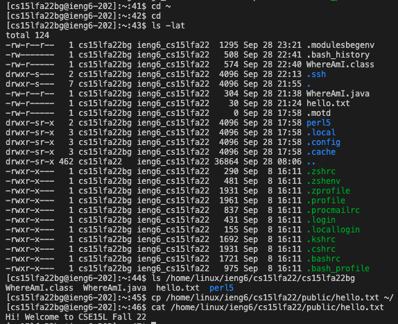

# Lab 1

### Hello, we will be working with ssh today!

## 1. Installing VS CODE

This is the easiest step. Download from the site below.      

Then, when you've installed it. Launch VS CODE          

## 2. Remotely connecting

Now, you want to get your course specific account/User ID to log in to UCSD's server at:     
https://sdacs.ucsd.edu/~icc/index.php             
Reset the password and then type in **ssh cs15lfa22zz@ieng6.ucsd.edu** where zz
is your unique id. It will ask you to type in your password you just reset.     

If it was your first time connecting, you might get a message asking if you want to       
continue connecting. Type in **yes**.

## 3. Trying some commands
Try these commands out.
- cd ~
- cd
- ls -lat
- ls -a
- ls <directory> where <directory> is /home/linux/ieng6/cs15lfa22/cs15lfa22abc,     
  where the abc is one of the other group members’ username
- cp /home/linux/ieng6/cs15lfa22/public/hello.txt ~/
- cat /home/linux/ieng6/cs15lfa22/public/hello.txt
  
The results will be like this.
  

These commands are the ones we learned during the first day of lecture. Revisit topics if necessary.
  
## 4. Moving files using scp
  
In this task, we will have to make a file at your local machine (WhereAmI.java) and import it
to UCSD's server or the remote machine.

We can test out the functionality of this file using the commands below.     

Then, we will use this command at your local machine to move it        
**scp WhereAmI.java cs15lfa22zz@&#65279;ieng6.ucsd.edu:~/**

If successful, the results will be like this,    
  

## 5. Setting a SSH Key

Now, entering your password every now and then is quite tedious. We can set up an SSH key at your local     
machine and then import it to the remote machine. The process can be done by the commands below.

Initiallizing the key at local machine.
  

  
Importing the key to the remote machine.

  
## 6. Optimizing remote running
  
Now, we can run commands on the remote machine without the tedious process of logging in first.    
Here are the examples:
  

