# Lab Report 2

## Search Engine

	class Handler implements URLHandler {
	    // The one bit of state on the server: a number that will be manipulated by
	    // various requests.
	    ArrayList<String> dictionary = new ArrayList<>();
	    ArrayList<String> temp = new ArrayList<>();
	    public String handleRequest(URI url) {
		temp.clear();
		if (url.getPath().equals("/")) {
		    return String.format("Ask me anything! Type in what you're looking for in the URL space(?s=).");
		} else if (url.getPath().contains("/add")) {
		    String[] parameters = url.getQuery().split("="); 
		    if (parameters[0].equals("s")) {
			dictionary.add(parameters[1]);
			return String.format(parameters[1] + " is added to the dictionary.");
		    }
		} else if (url.getPath().contains("/search")) {
		    String[] parameters = url.getQuery().split("="); 
		    if (parameters[0].equals("s")) {
			for (int num = 0; num < dictionary.size(); num++) {
			    if (dictionary.get(num).contains(parameters[1])) {
				temp.add(dictionary.get(num));
			    }
			}
			return String.format("Here's what we found about your related search:" + temp);
		    }
		    }
		return "Alert! 404 not found.";
	    }
	}

	class SearchEngine {
	    public static void main(String[] args) throws IOException {
		if(args.length == 0){
		    System.out.println("Missing port number! Try any number between 1024 to 49151");
		    return;
		}

		int port = Integer.parseInt(args[0]);

		Server.start(port, new Handler());
	    }
	}

                  
#### The page when you first launch
			
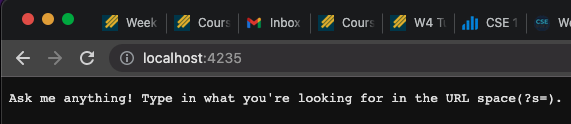

#### Adding a bunch of stuff to the dictionary..

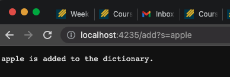          
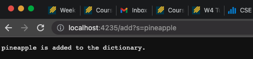        
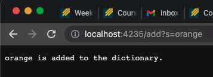         

#### Searching for the added terms in the dictionary...
			
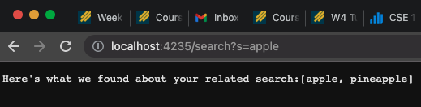              
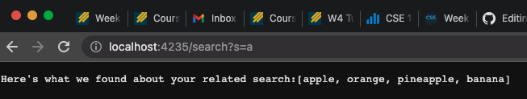       
                  
## Debugging

#### ArrayExamples

The actual code

	  // Changes the input array to be in reversed order
	  static void reverseInPlace(int[] arr) {
	    for(int i = 0; i < arr.length; i += 1) {
	      arr[i] = arr[arr.length - i - 1];
	    }
	  }

	  // Returns a *new* array with all the elements of the input array in reversed
	  // order
	  static int[] reversed(int[] arr) {
	    int[] newArray = new int[arr.length];
	    for(int i = 0; i < arr.length; i += 1) {
	      arr[i] = newArray[arr.length - i - 1];
	    }
	    return arr;
	  }

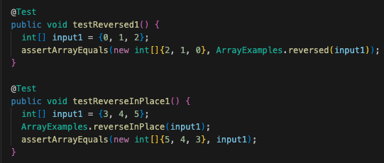             
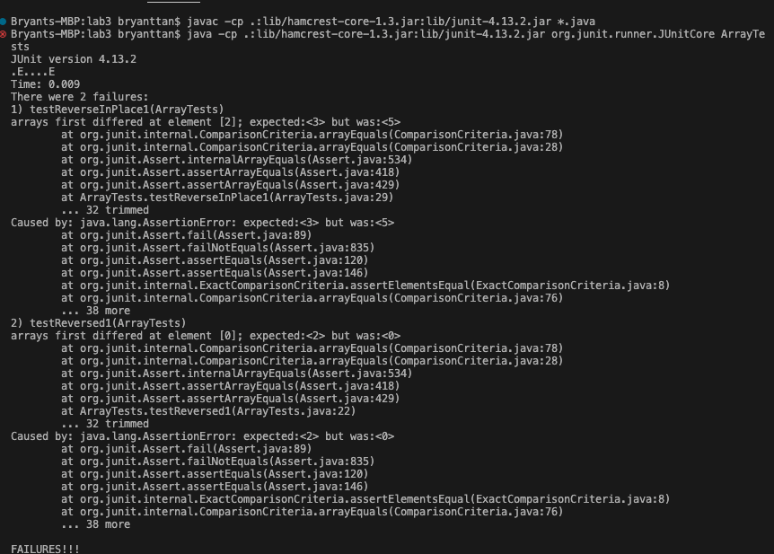

The fix required:

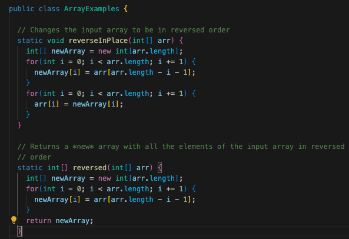  

#### LinkedList

The actual code:

    public void append(int value) {
        if(this.root == null) {
            this.root = new Node(value, null);
            return;
        }
        // If it's just one element, add if after that one
        Node n = this.root;
        if(n.next == null) {
            n.next = new Node(value, null);
            return;
        }
        // Otherwise, loop until the end and add at the end with a null
        while(n.next != null) {
            n = n.next;
            n.next = new Node(value, null);
        }
    }

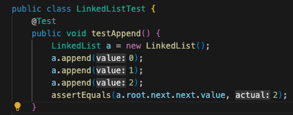             
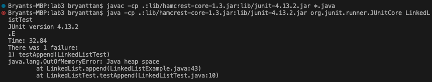 

The fix required:

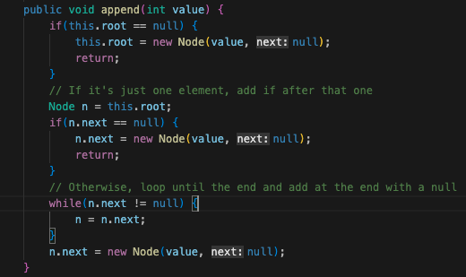      

