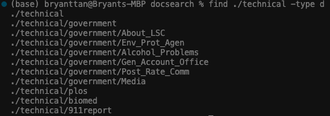
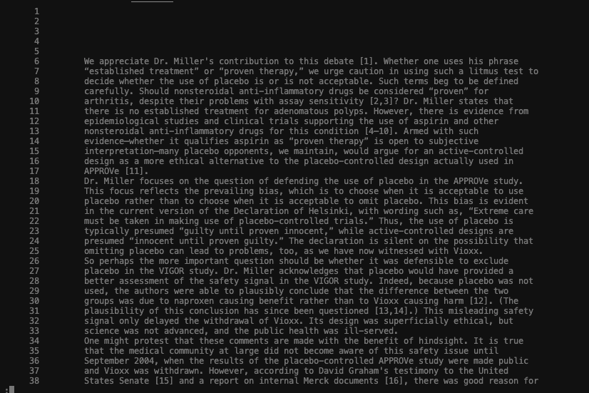

# Lab Report 3

First of all, a simple documentation is provided in the terminal if we type out any of these commands with "--help". For example, typing out find--help would give us tips on how to use this command and the various tools it comes with.

### Three interesting ways to use find

- We can find out the type of the file/directory. Here, d stands for directory. Other file types are c(character), b(block), f(regular file), etc. 

 

- We can look for empty files using the option below.

 

- We can look for files that are of a certain size using the option below. (The default is in 512 byte blocks if no suffix is used)

 

### Three interesting ways to use less

- We can use less to display files with numbered lines. 

 

Result:

 

- We can display the files and determine how relatively long it is in percentage.

 

Result:

 

Here, we see that the text is displayed in 64% of its original size. If we scroll down through the end, it will show 100%.

- We can highlight words in the displayed text.

 

Here, I wanted to highlight the word "is". The default syntax requires us to use / (backslash).

 

To navigate through the displayed text, we can type in n and the pointer will shift to the next occurence of the word "is".

 

### Three interesting ways to use grep

- We can use grep to count how often a word appears in the text. 

 

- We can list the files that have matching names and contain the word you are looking for.

 

- We are able to pull up the lines that don't contain the word being searched in the file.

 

