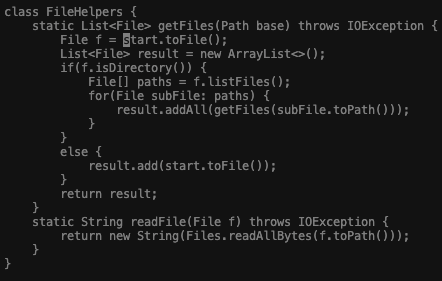

# Lab Report 4 - Vim

## Part 1 

### *Changing the name of the start parameter and its uses to base*

The command my partner and I came up with is 
'/start <Enter> dw i base <Esc> n dw i base <Esc> n dw i base <Esc> :wq <enter>'
and we believe this is the shortest sequence of code for the given task.
  
To do this, we have to open DocSearchServer.java in Vim by using the command below.
'vim DocSearchServer.java'
Once you press enter, the terminal will launch vim and this is what you will see.
  

Here, we want to change the string "start" into "base" for every occurrence in getFiles.
The simplest way to do this is by moving the cursor to "start" in Vim first and this is done by typing 
'/start'. / prompts Vim to search and move the cursor to the desired word.

  
After you press <Enter>, the cursor moves to the first occurence of the string "start".
  

  
Then, we would want to delete "start". The easiest way to do this is by typing 'dw', which means delete this word.
 

 
After that, we would want to go to insert from normal mode and type in the string "base". We do this by typing 'i' followed by "base". Dont forget to press <Esc> after you made this change so that you can go back from insert to normal mode.

 

  
  
After we have made the changes, we can directly go to the next occurrence of the string "start" by using 'n'
  

  
Then we can basically do the same thing with the first occurrence of "start" using the commands 'dw' then 'i' then type out "base" and <Esc> to back to normal mode. Then we repeat this process again for the third occurrence. To find the last occurrence we can just use 'n', like before, in normal mode.
 
'dw'

  
'i'

  
"base"

  
<Esc>

  
'n'

'dw'

  
'i'

  
"base"

![base1][base_1.png]
  
<Esc>

  
 After we are satisfied with the changes, we type in ':wq', which means save then quit vim.
  

  
Then, when we hit <Enter> we see that our file was modified by Vim and changes were appropriately made.
  

  
## Part 2

### *Comparison of editing on remote with and without Vim*
  
Time it took without Vim (Edit with VSC, then scp file, and run on remote) :
  
Time it took with Vim (log into remote, make the changes necessary using Vim, and run) :
  
Which of these two styles would you prefer using if you had to work on a program that you were running remotely, and why?
  

What about the project or task might factor into your decision one way or another? (If nothing would affect your decision, say so and why!)
  

