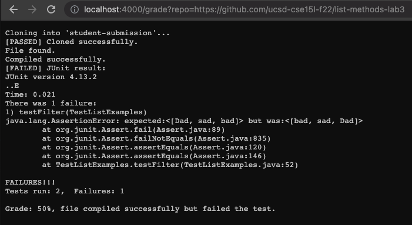
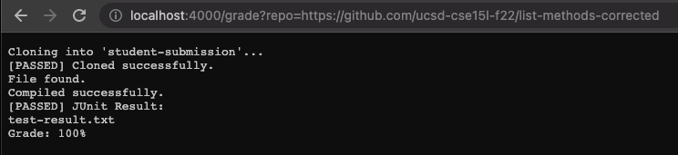
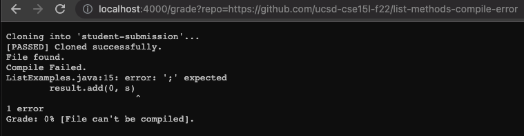

# Lab Report 5 - Autograders

## grade.sh 

        FILE='ListExamples.java'
        rm -rf student-submission
        git clone $1 student-submission

        if [[ $? -eq 0 ]]
        then
            echo "[PASSED] Cloned successfully."
        else
            echo "[FAILED] Clone failed. Check the submit URL."
            exit 1
        fi

        cd student-submission
        if [[ -f $FILE ]]
        then 
            echo "[PASSED] File found."
        else
            echo "[FAILED] File not found."
            echo "Grade: 0% [File wasn't even there]."
            exit 1
        fi  

        CP=".:../lib/hamcrest-core-1.3.jar:../lib/junit-4.13.2.jar"
        cp ../TestListExamples.java .

        javac -cp $CP *.java 2> comp-err.txt
        if [[ $? -eq 0 ]]
        then
            echo "[PASSED] Compiled successfully."
        else
            echo "[FAILED] Compile Failed."
            cat comp-err.txt
            echo "Grade: 0% [File can't be compiled]."
            exit 1
        fi

        java -cp $CP org.junit.runner.JUnitCore TestListExamples > test-result.txt
        if [[ $? -eq 0 ]]
        then
            echo "[PASSED] JUnit Result:"
            echo test-result.txt
            echo "Grade: 100%"
        else
            echo "[FAILED] JUnit result: "
            cat test-result.txt
            echo "Grade: 50%, file compiled successfully but failed the test."
            exit 1
        fi

## Three examples of repos being graded by my autograder

#### The first repo

This is my autograder with the link: https://github.com/ucsd-cse15l-f22/list-methods-lab3. As you can see here, the file didn't pass the test and has a few flaws.

This is my autograder with the link: https://github.com/ucsd-cse15l-f22/list-methods-corrected. As you can see here, the file passed all the test!

This is my autograder with the link: https://github.com/ucsd-cse15l-f22/list-methods-compile-error. As you can see here, the file didn't even compile.

## Detailed Explanation

Let's go over the first repo:         

In my code, I have every if statement running because I set the condition to be "if the exit code is 0 i.e. if the test passes, then run this".       

Here, we can see that the first course of action was to delete the student-submission directory and then clone the given link and place it inside of a directory called student-submission. If cloning the file was successful, then the exit code would return 0, which in this case is true. Then, because the exit code is 0, we enter the first if loop which checks if the exit code is 0 and echoes "[Passed] Clonned succesfully." if it is. If that wasn't the case, then the program will exit and echo "[FAILED] Clone failed. Check the submit URL."
